# 🧠 LABORATORIO 5: Uso de BiTalino para adquisición de señales EEG

---

## Índice

- [1. Introducción](#1-introducción)  
- [2. Objetivos](#2-objetivos)  
  - [2.1 Objetivo general](#21-objetivo-general)  
  - [2.2 Objetivos específicos](#22-objetivos-específicos)  
- [3. Materiales e Instrumentos](#3-materiales-e-instrumentos)  
- [4. Metodología](#4-metodología)  
  - [4.1 Preparación del software](#41-preparación-del-software)  
  - [4.2 Montaje de electrodos](#42-montaje-de-electrodos)  
  - [4.3 Secuencia experimental](#43-secuencia-experimental)  
  - [4.4 Ejercicios de análisis](#44-ejercicios-de-análisis)  
- [5. Resultados](#5-resultados)  
  - [5.1 Repositorio de vídeos](#51-repositorio-de-vídeos)  
  - [5.2 Gráficas obtenidas](#52-gráficas-obtenidas)  
- [6. Discusión e interpretación](#6-discusión-e-interpretación)  
  - [6.1 Ojos abiertos vs cerrados](#61-señales-crudas-vs-filtradas-08-48-hz--notch)  
  - [6.2 Tarea cognitiva (restas de 7 en 7)](#62-psd-por-grabación)  
  - [6.3 Parpadeo cada 2 segundos](#63-potencia-relativa-por-banda-δ-θ-α-β-γ)  
  - [6.4 Masticación cada 2 segundos](#64-comparación-de-α-813-hz-ojos-cerrados-ec-vs-ojos-abiertos-eo)  
  - [6.5 Actividades que involucraron música](#65-tarea-cognitiva-resta-100-7-y-comparación-en-β-1330-hz)  
- [7. Limitaciones y mejoras](#7-limitaciones-y-mejoras)  
- [8. Conclusiones](#8-conclusiones)  
- [9. Aporte de los integrantes](#9-aporte-de-los-integrantes)  

---

## 1. Introducción
La electroencefalografía (EEG) registra la actividad cerebral eléctrica usando electrodos en el cuero cabelludo. Posee un alta resolución temporal, debido a que su frecuencia se encuentra en el rango de milisegundos, lo que la ha llevado a convertirse en el instrumento principal del diagnóstico clínico, del desarrollo de interfaces de crecimiento del cerebro-computer (BCI) y del uso en investigación en neurociencia cognitiva [1].

### 1.1 Generación de la señal EEG

La corteza cerebral es la capa más externa del encéfalo, formada por sustancia gris con un grosor de 2 a 4 mm. Está organizada en seis capas histológicas que contienen diferentes tipos de neuronas y conexiones, siendo que en las capas III y V dónde se encuentran las neuronas de interés para el EEG, que son las piramidales. 

   
  <em>Figura 1. Ubicación de neuronas piramidales en corteza cerebral. Adaptado de: 
  <a href="https://www.kenhub.com/en/library/anatomy/cortical-cytoarchitecture">Kenhub (2025)</a>
  </em>

El EEG refleja principalmente la actividad dendrítica de las neuronas piramidales orientadas perpendicularmente a la superficie cortical. Al activarse en modo sincrónico, que producen dipolos eléctricos capaces de transmitirse hasta el cuero cabelludo [1]. 

   
  <em>Figura 2. Localización de neuronas en la corteza cerebral. Recuperado de: 
  <a href="https://www.researchgate.net/publication/317390321_Single-axon_level_morphological_analysis_of_corticofugal_projection_neurons_in_mouse_barrel_field/figures?lo=1">ResearchGate</a>
  </em>

Estas señales están de muy baja amplitud (10–100 µV) y requieren la activación simultánea de enormes poblaciones neuronales para que sean trasmisibles [1]. Además, no solo factor del estado fisiológico (estado de alerta, edad) sino del entorno (ruido eléctrico) incidirán en la calidad de la señal. En años ulteriores, reinterpretaciones han relevado cómo el modelado informático y la utilización de redes neuronales ayudan a entender mejor la dinámica de las señales del cortex en aplicaciones de BCI.

### 1.2 Bandas y reactividad alfa (EO vs EC)

Las oscilaciones EEG se agrupan en bandas de frecuencia asociadas a estados mentales:

   
  <em>Figura 3. Ondas cerebrales registradas en EEG. Recuperado de: 
  <a href="https://www.sciencedirect.com/topics/agricultural-and-biological-sciences/brain-waves">ScienceDirect</a>
  </em>

Delta (0.5–4 Hz): sueño profundo.

Theta (4–8 Hz): somnolencia y meditación.

Alfa (8–13 Hz): relajación y atención pasiva.

Beta (13–30 Hz): actividad cognitiva y alerta.

Gamma (>30 Hz): integración sensorial y procesos de conciencia.

La banda alfa mide el reflejo de reactividad al estado ocular: aumento con ojos cerrados (EC) y disminución con ojos abiertos (EO) como testimonio de bloqueo de procesamiento visual. Esta reactividad alfa se ha usado como biomarcador de integridad funcional y de estado del estado de la relajación [2].

### 1.3 Sistema 10–20, Fp1/Fp2 y artefactos oculares

El sistema internacional 10–20 asegura estandarización en la colocación de electrodos, permitiendo la comparabilidad entre estudios. Las posiciones Fp1 y Fp2, ubicadas en la región frontal, son sensibles a artefactos oculares, como parpadeos y movimientos sacádicos, que pueden superar en amplitud a la señal cerebral. Para mitigar estos artefactos se aplican algoritmos de Independent Component Analysis (ICA) y enfoques basados en atención profunda y redes neuronales que logran una supresión más efectiva conservando las señales neuronales [3], [4].

   
  <em>Figura 4. Sistema internacional 10-20 para posicionamiento de electrodos en EEG. Recuperado de: 
  <a href="https://www.researchgate.net/publication/328629992_Desarrollo_de_una_BCI_utilizando_el_potencial_P300_y_la_diadema_MindwaveR/figures?lo=1">ResearchGate</a>
  </em>

### 1.4 Electrodos: húmedos vs secos

Los electrodos húmedos de Ag/AgCl con gel conductor continúan siendo el estándar clínico por su baja impedancia y fidelidad en la captura de señales, aunque requieren preparación y mantenimiento, lo que limita su portabilidad [4]. Los electrodos secos han evolucionado usando materiales conductores flexibles y estructuras multipin, alcanzando así un desempeño comparable al de los húmedos en muchos escenarios. Estas innovaciones permiten aplicaciones portátiles y de larga duración en EEG móvil y monitoreo continuo [4], [5].

### 1.5 Muestreo, referencia y filtrado

La frecuencia de muestreo debe respetar el teorema de Nyquist, siendo habituales 256, 512 o 1024 Hz para capturar adecuadamente bandas de hasta 40–50 Hz [1]. La elección del electrodo de referencia, pudiendo ser mastoidales, Cz o promedio común, va a condicionar la topografía y también la amplitud de las señales. El filtrado digital constituye un paso crítico en el preprocesamiento:

- Pasabanda (0.5–45 Hz): elimina deriva y ruido de alta frecuencia.
- Notch (50/60 Hz): suprime la interferencia eléctrica de la red.
- Filtros adaptativos: corrigen artefactos dinámicos (p. ej., EOG o ECG).

Recientemente se han desarrollado métodos de aprendizaje profundo para la eliminación de artefactos que mejoran la relación señal/ruido frente a los filtros clásicos [6].

---

## 2. Objetivos

### 2.1 Objetivo general
Registrar, procesar y analizar señales EEG mediante el uso del sistema BITalino (r)evolution y el software OpenSignals, con el fin de comprender la dinámica de las bandas cerebrales bajo diferentes condiciones (reposo, tarea cognitiva y artefactos controlados) y aplicar técnicas de filtrado y cuantificación espectral para su interpretación.

### 2.2 Objetivos específicos
- Montar y configurar un BITalino (r)evolution Board Kit BLE/BT para registrar señales EEG.
- Identificar las ubicaciones Fp1, Fp2 y O2 del sistema internacional 10‑20 y colocar electrodos correctamente.
- Adquirir segmentos EEG en condiciones: basal (ojos abiertos/cerrados), tarea cognitiva y artefactos controlados.
- Aplicar filtro band‑pass 0.8–48 Hz y reconocer los ritmos δ, θ, α, β.
- Exportar los datos y generar un informe breve con hallazgos cuantitativos.

---

## 🛠️ 3. Materiales e Instrumentos
## 🧰 Descripción de materiales

| Ítem                                   | BITalino (r)evolution Board Kit BLE/BT | Laptop con Bluetooth 4.0+          | Software OpenSignals (r)evolution | Electrodos Ag/AgCl desechables (gel) | Ultracortex Mark IV (headset seco) |
|----------------------------------------|-----------------------------------------|------------------------------------|-----------------------------------|---------------------------------------|------------------------------------|
| **Función principal**                  | Módulo de adquisición de biosenales     | Procesamiento y visualización      | Registro y análisis de señales    | Registro de señal EEG                 | Registro con electrodos secos       |
| **Detalles técnicos**                  | Entradas: ECG, EMG, EEG, EDA            | Software *OpenSignals* + Python    | Compatible con BITalino           | Sensores de un solo uso               | Electrodos activos, portátil        |
| **Cantidad por grupo**                 | 1                                       | 1                                  | -                                 | 3                                     | Rotativo (demo)                     |

   
  <em>Figura 5. Setup para la adquisición de señales EEG.</em>

---

## 🔍 4. Metodología

### 4.1 Preparación del software
- Se instaló el programa **OpenSignals (r)evolution**, compatible con el sistema BITalino, en la laptop 
- Se emparejó el **BITalino (r)evolution Board Kit BLE/BT** mediante Bluetooth
- Se configuró el canal **A4 como EEG** y se definió una **frecuencia de muestreo de 1000 Hz**, lo que asegura cubrir la banda de interés (0.5–48 Hz).  
- Se verificó que el nivel de batería del dispositivo fuera superior al 30 % antes de iniciar la sesión.

### 4.2 Montaje de electrodos
- Se seleccionaron las posiciones **Fp1, Fp2 y mastoide derecha**, siguiendo el sistema internacional **10–20**.  
- Conexión realizada:  
  - **Canal EEG → Fp1**  
  - **GND → Fp2**  
  - **Referencia → mastoide derecha**  
- Previa colocación, se limpió la piel con una papel y alcohol para limpiarla.
- Se usaron audífonos para evitar interferencias con sonidos, se posicionó al voluntario mirando hacia dónde no recibiera luz directa, debido a el espacio del laboratorio el área más próxima fue cercana a la puerta.
- Cuando la tarea solicitaba tener los ojos cerrados, se le solicitó al voluntario que los cierre, debido a que no se contaba con ningún dispositivo adicional no se lo pudo tapar de mejor manera los ojos.

   
  <em>Figura 6. Colocación de electrodos en posiciones Fp1, Fp2 y mastoide.</em>

### 4.3 Secuencia experimental
El registro de señales se llevó a cabo siguiendo diferentes condiciones, cada una con una duración aproximada de 1–2 minutos:

| Condición                | Descripción                                                                 | Video                                     |
|---------------------------|-----------------------------------------------------------------------------|-------------------------------------------|
| **Basal – ojos abiertos** | Participante fijó la vista en un punto frente a él, evitando movimientos bruscos. | *(No disponible)*                          |
| **Basal – ojos cerrados** | Participante mantuvo los ojos cerrados en reposo.                           | [🎥 Ver video](Multimedia/PRUEBA%202.mp4) |
| **Tarea cognitiva**       | Ejecución de restas sucesivas desde 100 en intervalos de 7 (100, 93, 86, …). | [🎥 Ver video](Multimedia/PRUEBA%203.mp4) |
| **Artefactos controlados**| Se realizaron parpadeos voluntarios cada ~2 segundos y luego masticando.    | [🎥 Ver video](Multimedia/PRUEBA%204.mp4) |
| **Condición libre**       | El participante escuchó música clásica, luego rock y por último ondas alfa. | [🎥 Ver video](Multimedia/PRUEBA%205.mp4) |

---

## 📊 5. Resultados

### 5.1 Repositorio de vídeos

| Condición                | Archivo de vídeo     | Enlace                                                  |
|---------------------------|----------------------|---------------------------------------------------------|
| **Basal – ojos abiertos** | *(No disponible)*    | -                                                       |
| **Basal – ojos cerrados** | PRUEBA 2.mp4         | [🎥 Ver video](Multimedia/PRUEBA%202.mp4)               |
| **Tarea cognitiva**       | PRUEBA 3.mp4         | [🎥 Ver video](Multimedia/PRUEBA%203.mp4)               |
| **Artefactos controlados**| PRUEBA 4.mp4         | [🎥 Ver video](Multimedia/PRUEBA%204.mp4)               |
| **Condición libre**       | PRUEBA 5.mp4         | [🎥 Ver video](Multimedia/PRUEBA%205.mp4)               |

### 5.2 Gráficas obtenidas

#### 5.2.1 Ojos abiertos

  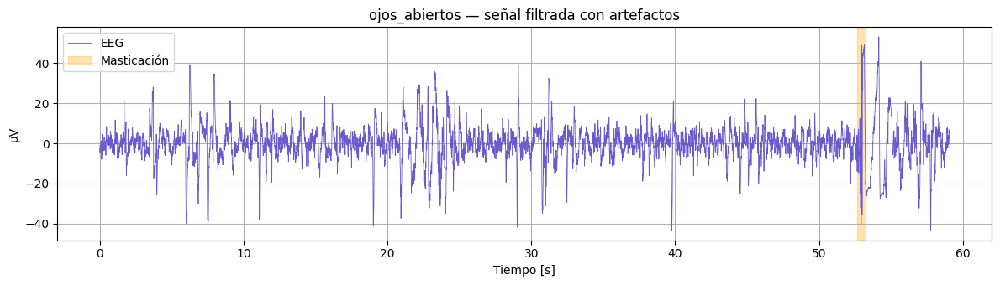

#### 5.2.2 Ojos cerrados

  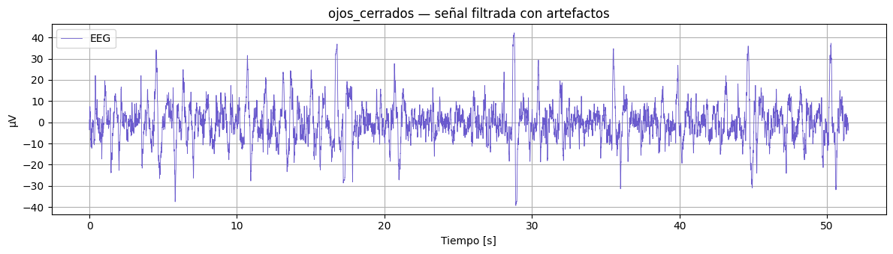

#### 5.2.3 Tarea cognitiva

  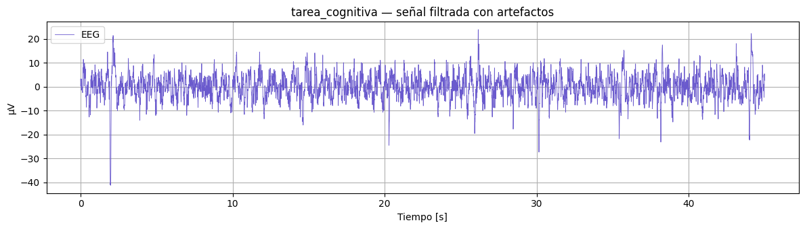

#### 5.2.4 Parpadeo

  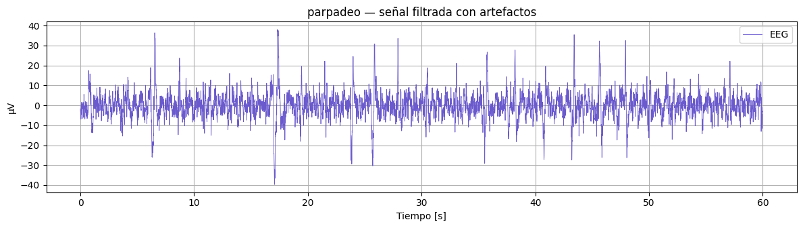

#### 5.2.5 Masticación

  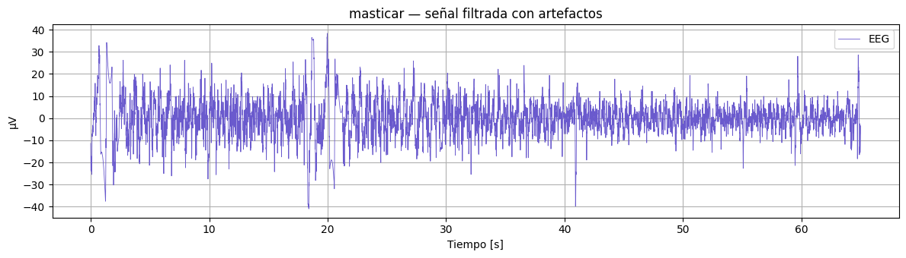

#### 5.2.6 Sin música

  

#### 5.2.7 Musica clásica

  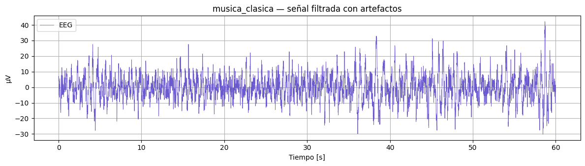

#### 5.2.8 Ondas alfa

  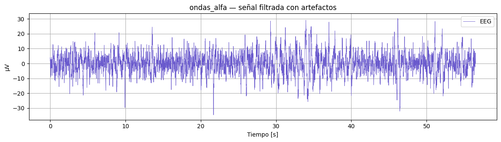

#### 5.2.9 Musica metal

  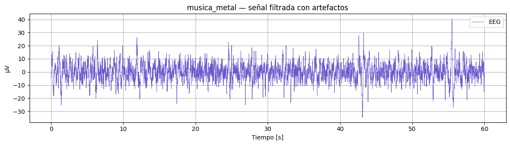

#### 5.2.10 Potencia de bandas

  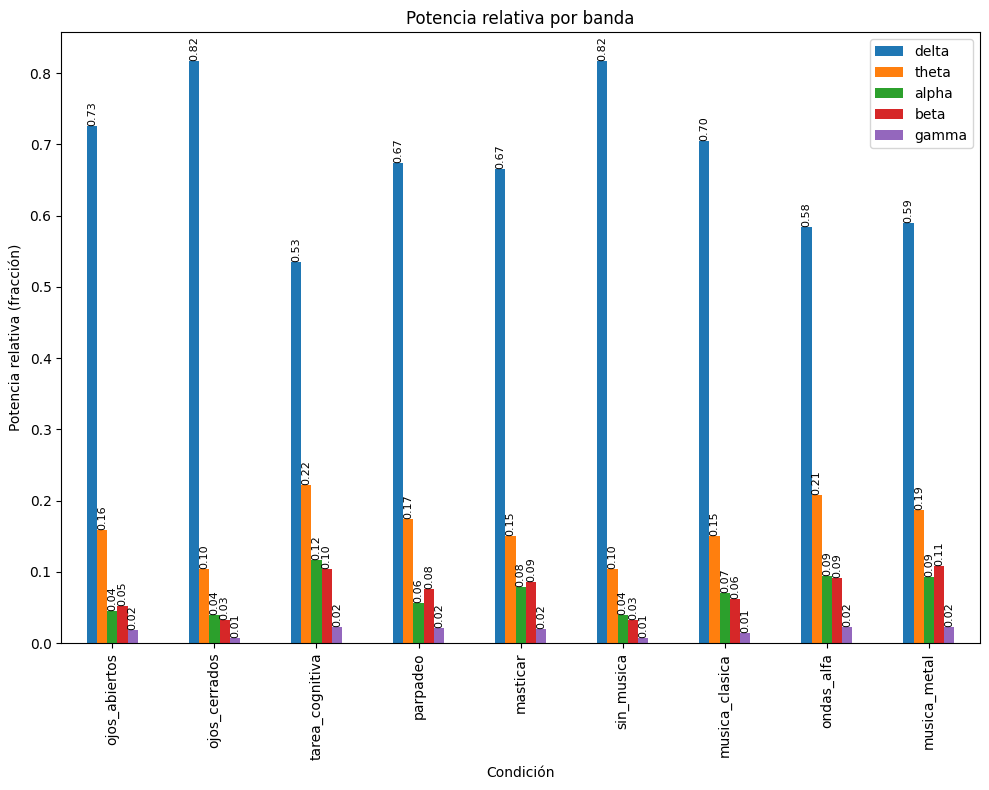

#### 5.2.11 Ojos abiertos vs cerrados (PSD)

  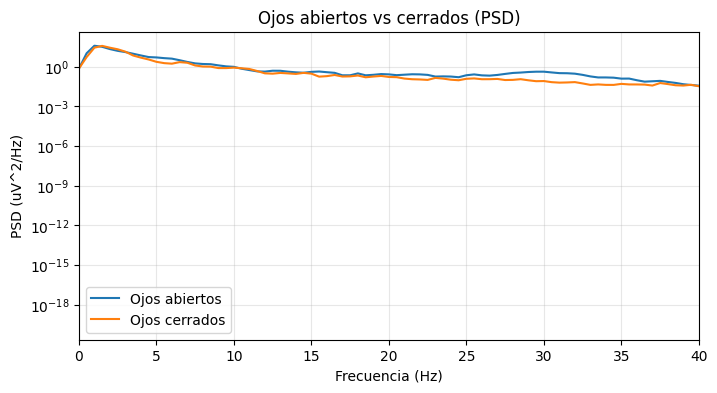

#### 5.2.12 Tarea cognitiva vs reposo (PSD)

  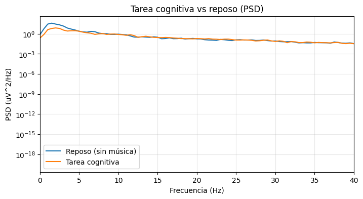

#### 5.2.12 Comparacion entre musicas (PSD)

  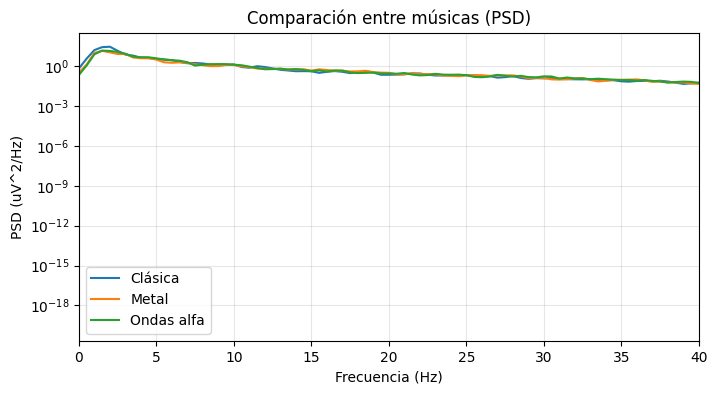

---

## 💭 6. Discusión e interpretación
Cabe resaltar que en el registro PSD para las 5 ondas cerebrales, hay una predominancia de las ondas delta que normalmente se deberían dar durante el sueño. Se hizo enfasis en la aplicación de filtros para un buen procesamiento, pero de todos modos esas fueron las potencias obtenidas. Un artículo encontrado comenta de que las personas que tengan cierto grado de privación de sueño o duerman menos horas de las que requieren pueden tener una predominancia de las ondas delta [7]. Como el sujeto que realizó las pruebas recientemente no habia dormido más de 6 horas, es posible que se haya alguna relación de esa situación con la predominancia de ondas delta. Sin embargo, para el siguiente análisis se dará mayor importancia al resto de ondas según la actividad realizada.

Se analiza tanto el registro en voltaje como la potencia de ondas PSD.
### 6.1 Ojos abiertos vs cerrados
Ojos abiertos: Se espera una señal sin nigun patrón en particular, característico de un EEG, y es lo que se observa. Casi al final de la señal vemos que hay un ligero pico de voltaje debido a una masticación que el sujeto hizo sin percatarse.
Ojos cerrados: Se puede apreciar que hay una mayor cantidad de picos de voltaje en ojos cerrados con respecto al abierto, esto posiblemente se deba a que el suejeto inconsientemente movió los ojos ligeramente más cuando tiene los parpados cerrados.

### 6.2 Tarea cognitiva (restas de 7 en 7)
Durante una tarea cognitiva de resta mental, se observó en el EEG una aumentada actividad en la banda theta (≈4–7 Hz) en compaarcion con las demas actividades,acompañada de una disminución relativa de la potencia en la banda alpha (≈8–12 Hz), lo que indica un mayor esfuerzo cognitivo y enfoque de atención interna. Este patrón coincide con resultados reportados en trabajos recientes sobre carga cognitiva, donde la theta frontal se eleva al aumentar la demanda mental mientras que la alpha disminuye en tareas de atención sostenida [8].

### 6.3 Parpadeo cada 2 segundos
Durante la actividad de parpadeo se evidenciaron variaciones transitorias en la potencia de la banda alpha (≈8–12 Hz), particularmente en regiones occipitales. Estos cambios reflejan la activación y desactivación cortical que ocurre al cerrar y abrir los ojos, donde la potencia alpha aumenta con los ojos cerrados y disminuye cuando se abren o durante el parpadeo. Dicho fenómeno es ampliamente reconocido como un marcador fisiológico confiable para validar la calidad de la señal EEG y el estado de alerta del sujeto [9].

### 6.4 Masticación cada 2 segundos
Durante la actividad de masticación, la señal EEG presentó un incremento de alta frecuencia (≥20 Hz), atribuible en gran medida a la contracción de los músculos faciales y mandibulares, lo que constituye un artefacto electromiográfico. No obstante, algunos estudios señalan que la masticación también involucra redes corticales relacionadas con la coordinación motora y la atención, lo que puede observarse en modulaciones de la banda theta y beta. Por ello, este tipo de actividad debe interpretarse con cautela, distinguiendo entre componentes neuronales y contaminaciones musculares [10].

### 6.5 Actividades que involucraron música
 Lo primero que notamos es que cuando no escucha musica, la señal tiene menos frecuencia en comparación con ecuchar musica clasica. Escuchar música genera modulaciones claras en la actividad cerebral registrada por EEG en comparación con el estado de reposo en silencio. Se ha descrito que la música folclórica e instrumental clásica aumenta la potencia relativa en ondas lentas (delta y theta), lo que refleja un estado más relajado, especialmente en regiones frontales y occipitales[11]. Asimismo, escuchar música familiar induce una supresión sostenida de las bandas alpha y low-beta, vinculada a procesos de atención y reconocimiento [12]. Por otro lado, se ha observado que la música preferida o relajante puede aumentar la conectividad funcional en bandas theta y alpha, al tiempo que reduce la beta, lo que sugiere una modulación del estado cognitivo y emocional frente al silencio. Al comparar los registros de EEG durante la condición de silencio y música clásica frente a la exposición a música de ondas alfa y heavy metal, se evidenció un incremento en la frecuencia y potencia de las oscilaciones registradas. En particular, las condiciones de ondas alfa y heavy metal mostraron un aumento de la actividad theta (4–7 Hz) y beta (13–30 Hz), lo que sugiere un mayor grado de activación cortical y compromiso cognitivo en comparación con estados de reposo o estimulación musical más relajante. Estos hallazgos son consistentes con investigaciones que han demostrado que ciertos estilos musicales pueden modular de forma diferencial la dinámica cerebral. La música relajante o clásica tiende a favorecer un predominio de ondas lentas y alpha, asociadas con relajación y estados de reposo, mientras que la música más estimulante, como el heavy metal, induce aumentos significativos en la actividad beta y theta, reflejando mayor excitación emocional, atención sostenida y activación motora [12].

---

## 🚫⚠️ 7. Limitaciones y mejoras
Entre las principales limitaciones del presente registro EEG se encuentra el uso de un número reducido de electrodos (tres), lo cual restringe la capacidad de localizar de manera precisa las fuentes corticales de la actividad observada. Asimismo, la señal puede estar contaminada por artefactos fisiológicos, como movimientos musculares o parpadeos, que afectan la interpretación. Para mejorar futuros análisis, sería recomendable implementar un mayor número de canales, aplicar técnicas más robustas de filtrado y artefacto-remoción, así como complementar el registro con tareas controladas y protocolos estandarizados.

---

## 📰 8. Conclusiones
Los resultados sugieren que las diferentes condiciones evaluadas (reposo, tareas cognitivas y estimulación musical) producen modulaciones características en las bandas de frecuencia del EEG, evidenciando que el tipo de actividad influye directamente en la dinámica cerebral. En particular, se observó un aumento de theta y beta en tareas cognitivas demandantes y bajo estímulos musicales más intensos, mientras que condiciones de reposo y música relajante se asociaron con mayor potencia en la banda alpha. Estos hallazgos, aunque preliminares, respaldan la utilidad del EEG como herramienta para estudiar la relación entre actividad cerebral y estímulos externos o cognitivos.

---

## 9. Referencias

1. U. Salahuddin y P.-X. Gao, “Signal Generation, Acquisition, and Processing in Brain Machine Interfaces: A Unified Review,” *Frontiers in Neuroscience*, vol. 15, 2021. [En línea]. Disponible en: [https://www.frontiersin.org/articles/10.3389/fnins.2021.728178/full](https://www.frontiersin.org/articles/10.3389/fnins.2021.728178/full)  

2. O. M. Bazanova y D. Vernon, “Interpreting EEG alpha activity,” *Frontiers in Human Neuroscience*, vol. 14, p. 594, 2020. [En línea]. Disponible en: [https://www.frontiersin.org/articles/10.3389/fnhum.2020.594/full](https://www.frontiersin.org/articles/10.3389/fnhum.2020.594/full)  

3. A. Delorme *et al.*, “Enhanced ICA-based artifact removal for EEG,” *NeuroImage*, vol. 209, p. 116506, 2020. [En línea]. Disponible en: [https://www.sciencedirect.com/science/article/pii/S1053811920302418](https://www.sciencedirect.com/science/article/pii/S1053811920302418)  

4. Y. M. Chi *et al.*, “Dry EEG electrodes for mobile and wireless systems,” *IEEE Transactions on Biomedical Engineering*, vol. 67, no. 5, pp. 1398–1405, mayo 2020. [En línea]. Disponible en: [https://ieeexplore.ieee.org/document/8953212](https://ieeexplore.ieee.org/document/8953212)  

5. A. Mahajan *et al.*, “Flexible Dry Electrodes for Long-Term EEG Monitoring,” *Sensors*, vol. 21, no. 3, p. 987, 2021. [En línea]. Disponible en: [https://www.mdpi.com/1424-8220/21/3/987](https://www.mdpi.com/1424-8220/21/3/987)  

6. R. Jiang *et al.*, “A novel EEG artifact removal algorithm based on an advanced attention mechanism,” *Scientific Reports*, vol. 15, art. 19419, 2025. [En línea]. Disponible en: [https://www.nature.com/articles/s41598-025-98653-1](https://www.nature.com/articles/s41598-025-98653-1)  

7. H. Helakari et al., “Effect of sleep deprivation and NREM sleep stage on physiological brain pulsations,” Front. Neurosci., vol. 17, p. 1275184, 2023.

8. S. Chikhi, N. Matton, and S. Blanchet, “EEG power spectral measures of cognitive workload: A meta-analysis,” Psychophysiology, vol. 59, no. 6, p. e14009, 2022.

9. C. C. Liu, S. Ghosh Hajra, G. Pawlowski, S. D. Fickling, X. Song, and R. C. N. D’Arcy, “Differential neural processing of spontaneous blinking under visual and auditory sensory environments: An EEG investigation of blink-related oscillations,” Neuroimage, vol. 218, no. 116879, p. 116879, 2020.

10.  W. Y. Peh, Y. Yao, and J. Dauwels, “Transformer convolutional neural networks for automated artifact detection in scalp EEG,” Annu. Int. Conf. IEEE Eng. Med. Biol. Soc., vol. 2022, pp. 3599–3602, 2022.

11. B. B. El Sayed, M. A. Basheer, M. S. Shalaby, H. R. El Habashy, and S. H. Elkholy, “The power of music: impact on EEG signals,” Psychol. Res., vol. 89, no. 1, p. 42, 2025.

12. A. Malekmohammadi, S. K. Ehrlich, J. P. Rauschecker, and G. Cheng, “Listening to familiar music induces continuous inhibition of alpha and low-beta power,” J. Neurophysiol., vol. 129, no. 6, pp. 1344–1358, 2023.
