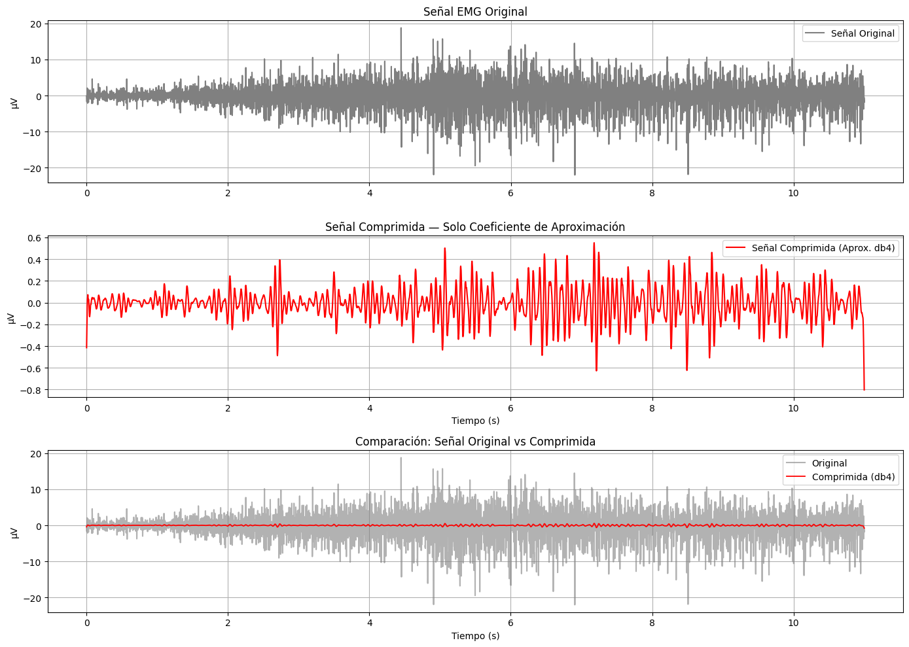

# **Laboratorio 8: Transformada Wavelet**
## Introducción
El análisis de señales cuyas características varían en el tiempo es un desafío para el procesamiento digital. Para dichas señales, la transformada de Fourier se ve limitada debido a que esta se usa con señales estacionarias, lo que limita su capacidad para detectar eventos rápidos o transitorios [1]. Es por ello que la transformada wavelet resulta eficaz para analizar este tipo de señales porque permite analizar el tiempo y frecuencia de manera conjunta. 

La transformada wavelet descomponer una señal en versiones escaladas y desplazadas de una función base llamada mother wavelet. A diferencia de la transformada de Fourier, las wavelets se adaptan en escala y posición, lo que facilita analizar simultáneamente las partes lentas y los cambios rápidos de la señal. Esta descomposición se organiza en distintos niveles: los coeficientes de aproximación muestran las tendencias generales, mientras que los coeficientes de detalle resaltan variaciones transitorias [2]. 

Existen diversas familias de wavelets con propiedades particulares: las Daubechies, compactas y útiles en señales con bordes definidos; las Symlets, simétricas y adecuadas para reconstrucciones precisas; las Coiflets, con regularidad matemática para aplicaciones en señales biomédicas; y las biortogonales, que permiten una reconstrucción exacta gracias al uso de pares de funciones de análisis y síntesis [3]. La selección de la familia wavelet depende del tipo de señal a estudiar, del objetivo del análisis y de los requisitos de reconstrucción.

Debido a esto se puede emplear en múltiples áreas: en biomedicina, para el análisis de señales cardíacas y cerebrales; en la industria mecánica, para la detección temprana de fallas en equipos complejos como cajas de engranajes; y en la ingeniería ambiental, para el monitoreo de variables dinámicas como la calidad del aire [4], [5]. 

## Objetivos específicos
1. Aplicar la transformada wavelet para analizar señales EEG, EMG y EEG.
2. Comprender la utilidad de la transformada wavelet en el filtrado digital.
3. Diseñar un filtro digital basado en una familia de la transformada wavelet y justificar su configuración con respaldo en literatura científica reciente.

## Diseño del filtro
1. Elegir la familia de wavelet y justificar su elección.
2. Definir los parámetros del filtro.
3. Respaldar la elección con un artículo o referencia técnica.

## Resultados
### Señales EMG
#### Comparación general de señales EMG — Bíceps Braquial
| Condición | Señal Cruda | Señal Filtrada (Wavelet Daubechies 4) |
|:--:|:--:|:--:|
| **Reposo** |  |  |
| **Contracción isométrica máxima** |  |  |

#### Comparación general de señales EMG — Flexor
| Condición | Señal Cruda | Señal Filtrada (Wavelet Daubechies 4) |
|:--:|:--:|:--:|
| **Reposo** |  |  |
| **Contracción isométrica máxima** |  |  |

#### Transformada y descomposición Wavelet
| Análisis | Imagen |
|:--:|:--:|
| Transformada de Wavelet Continua (Bíceps) |  |
| Transformada de Wavelet Continua (Flexor) |  |
| Scalograma de potencia (Bíceps) |  |
| Scalograma de potencia (Flexor) |  |
| Detalle Nivel 1 (Bíceps) |  |
| Detalle Nivel 1 (Flexor) |  |
| Aproximación muy baja frecuencia (Bíceps) |  |
| Aproximación muy baja frecuencia (Flexor) |  |
| Energía por banda (Bíceps) |  |
| Energía por banda (Flexor) |  |

#### Análisis en frecuencia
| Representación | Imagen |
|:--:|:--:|
| Espectro de frecuencias (Bíceps) |  |
| STFT de la señal (Bíceps) |  |
| Espectro de frecuencias (Flexor) |  |
| STFT de la señal (Flexor) |  |

#### Comparación general de señales — Bíceps Braquial (EMG) y ECG

| Condición | Señal EMG (Cruda) | Señal ECG (Cruda) | Señal EMG (Filtrada Wavelet Daubechies 4) | Señal ECG (Filtrada) |
|:--:|:--:|:--:|:--:|:--:|
| **Reposo** |  |  |  |  |
| **Contracción isométrica máxima** |  |  |  |  |

> 💬 *Ambas señales muestran sincronía temporal en picos de activación muscular (EMG) y ritmo cardiaco (ECG). El filtrado Wavelet reduce artefactos sin perder morfología.*

---

#### Comparación general de señales — Flexor (EMG) y ECG

| Condición | Señal EMG (Cruda) | Señal ECG (Cruda) | Señal EMG (Filtrada Wavelet Daubechies 4) | Señal ECG (Filtrada) |
|:--:|:--:|:--:|:--:|:--:|
| **Reposo** |  |  |  |  |
| **Contracción isométrica máxima** |  |  |  |  |

> 💬 *Durante la contracción máxima, se observa aumento de la amplitud EMG y leve variación en frecuencia del ECG, compatible con respuesta simpática transitoria.*

---

#### Transformada y descomposición Wavelet (EMG y ECG)

| Análisis | EMG | ECG |
|:--:|:--:|:--:|
| Transformada Wavelet Continua (Bíceps) |  |  |
| Transformada Wavelet Continua (Flexor) |  |  |
| Scalograma (Bíceps) |  |  |
| Scalograma (Flexor) |  |  |
| Detalle Nivel 1 (10–25 Hz) |  |  |
| Aproximación (muy baja frecuencia) |  |  |
| Energía por banda |  |  |

---

#### Análisis en frecuencia (FFT y STFT)

| Representación | EMG | ECG |
|:--:|:--:|:--:|
| Espectro de frecuencias (Bíceps) |  |  |
| STFT de la señal (Bíceps) |  |  |
| Espectro de frecuencias (Flexor) |  |  |
| STFT de la señal (Flexor) |  |  |

## Discusión
1. Discutir los resultados.

## Bibliografía
[1] V. Sunitha and S. S. Ali, “Wavelet Transform in Depth Study and Its Application,” Int. J. Creative Research Thoughts (IJCRT), vol. 11, no. 9, pp. 1–12, Sep. 2023. [Online]. Available: https://ijcrt.org/papers/IJCRT2309449.pdf

[2] V. Sunitha and S. S. Ali, “Wavelet Transform in Depth Study and Its Application,” International Journal of Creative Research Thoughts (IJCRT), vol. 11, no. 9, pp. 1–12, Sep. 2023. [Online]. Available: https://ijcrt.org/papers/IJCRT2309449.pdf 

[3] T.-D. Nguyen and P.-D. Nguyen, “Improvements in the Wavelet Transform and Its Variations: Concepts and Applications in Diagnosing Gearbox in Non-Stationary Conditions,” Applied Sciences, vol. 14, no. 11, Art. no. 4642, May 2024. [Online]. Available: https://www.mdpi.com/2076-3417/14/11/4642

[4] Z. Klai, M. Ayari, A. ElKamel, and M. A. Hammami, “From Theory to Practice: The Application of Wavelet Transform in Real-Time Engineering,” J. Appl. Math. & Informatics, vol. 42, no. 6, pp. 1341–1366, Oct. 2024. [Online]. Available: https://koreascience.kr/article/JAKO202404372004093.pdf

[5] T.-D. Nguyen and P.-D. Nguyen, “Improvements in the Wavelet Transform and Its Variations: Concepts and Applications in Diagnosing Gearbox in Non-Stationary Conditions,” Applied Sciences, vol. 14, no. 11, Art. no. 4642, May 2024. [Online]. Available: https://www.mdpi.com/2076-3417/14/11/4642
